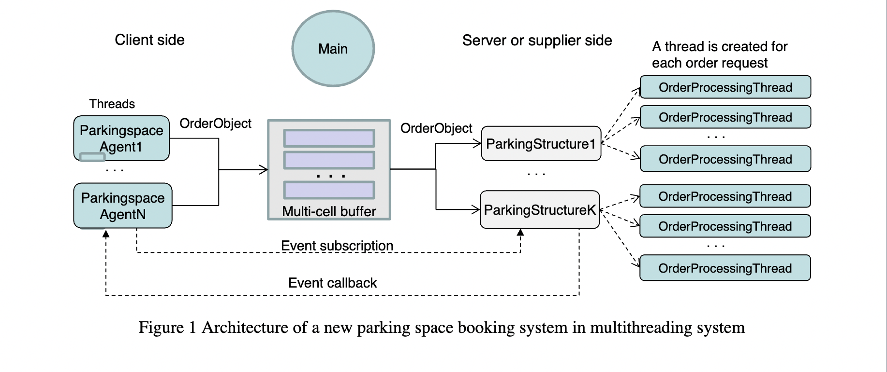

# Parking_space_block_booking_system
This repo creates a new parking space block booking system that involves parking space agents and parking structures (parking structure owners). The system consists of multiple parking space agents (clients) and multiple parking structures (servers). The parking space agents can buy in quantity (block) of parking spaces from the parking structures with lower (discounted) prices, and then resell the parking spaces
to their customers (end users) at competitive prices. The required architecture and the major components of the system are shown below.

In this system, both clients and servers are simulated in one system using multithreading and event-driven programming.
An Operation Scenario of the parking space block booking system is outlined as follows:
(1) A ParkingStructure uses a pricing model to calculate dynamically the parking space price for the parking space agents. The prices can go up and down from time to time. If the new price is lower than the previous price, it emits a (promotional) event and calls the event handlers in the parking space agents (clients) that have subscribed to the event.
(2) A ParkingAgent evaluates the needs based on the new price and other factors, generates an OrderObject (consisting of multiple values), and sends the order to the parking structure through a MultiCellBuffer.
(3) The ParkingAgent sends the OrderObject to the promoting parking structure through one of the free cells in the MultiCellBuffer.
(4) The ParkingStructure receives the OrderObject from the MultiCellBuffer.
(5) The ParkingStructure creates a new thread, an OrderProcessingThread, to process the order;
(6) The OrderProcessingThread processes the order, e.g., checks the credit card number and the maximum number allowed to purchase, etc., and calculates the total amount.
(7) The OrderProcessingThread sends a confirmation to the parking space agent and prints the order information (on screen).

# Run the project
Open the project in Visual Studio and then hit F5 or press the Run button. You can change the number of Parking Structure threads by changing the value of K and Parking Agency threads by changing the value of N in ParkingBooking.cs file
